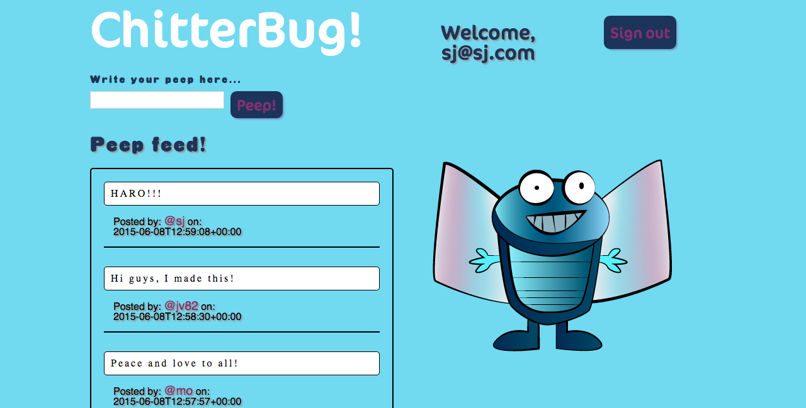

 

Chitter Challenge
=================

## Tech used

Ruby, Sinatra, Postgreql, DataMapper, Rspec/Capybara, CSS, Heroku, Travis CI

## Lessons Learned

This challenge was the first real introduction I had to the MVC pattern, and to databases within a web development context. I was pleased with what I produced with this challenge in particular my takeaway understanding of an MVC. I would be good to implement a feature that users can reply to each other, which would be done by creating an association such as; a comment has many replies.

You can take a look at this app at [heroku here](https://chitterbug.herokuapp.com/)

## Screenshot

Challenge:
-------

* Challenge time: Friday afternoon (+ weekend if you need it)
* Feel free to use google, your notes, books, etc but work on your own
* You must submit a pull request to this repo with your code by 9am Monday morning

As usual please start by 

* Filling out your learning plan self review for the week: https://github.com/makersacademy/learning_plan (if you haven't already)
* Forking this repo

We are going to write a little Twitter clone that will allow the users to post messages to a public stream.

Features:
-------

* In order to use chitter as a maker I want to sign up to the service
* In order to user chitter as a maker I want to log in
* In order to avoid others using my account as a maker I want to log out
* In order to let people know what I am doing as a maker I want to post a message (peep) to chitter
* In order to see what people have to say as a maker I want to see all peeps in chronological order

Notes:
------

* Makers sign up to chitter with their email, password, name and a user name (e.g. sam@makersacademy.com, s3cr3t, Samuel Russell Hampden Joseph, tansaku).
* The username and email are unique.
* Peeps (posts to chitter) have the name of the maker and their user handle.
* Use bcrypt to secure the passwords.
* Use data mapper and postgres to save the data.
* You don't have to be logged in to see the peeps.
* You only can peep if you are logged in.
* Finally submit a pull request before Monday at 9am with your solution or partial solution.  However much or little amount of code you wrote please please please submit a pull request before Monday at 9am

Bonus:
-----

If you have time you can implement the following:

* In order to start a conversation as a maker I want to reply to a peep from another maker.

And/Or:

* Work on the css to make it look good (we all like beautiful things).

Good luck and let the chitter begin!
